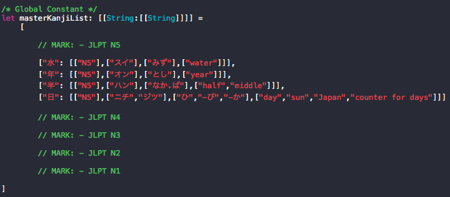

# JLPT Kanji Jisho

## About

JLPT Kanji Jisho is an open source Swift application that will ultimately contain a native Swift data model that captures all of the kanji contained in the various levels of the Japanese Language Proficiency Test (the "*_JLPT_*").

The JLPT is a test given worldwide that tests a student's knowledge of Japanese. The test evaluates various elements of how well a student has mastered the Japanese language, including the student's knowledge of kanji, which are the Chinese-based characters that are used in Japanese writing. The JLPT is split into five different levels (N5, N4, N3, N2, N1) with N5 being the easiest and N1 being the hardest. The official website of the test can be found at [www.jlpt.jp/e](http://www.jlpt.jp/e).

This application attempts to be a comprehensive resource (primarily through its data model) for anyone who wants to build a Swift application and needs a comprehensive list of the kanji (along with all of their meanings and readings) that appear for all levels of the test. 

## The Model

The model is a native Swift array of dictionaries, each dictionary containing the kanji character as its key. The value to each key is an array of arrays that contain strings that represent all of the information about that kanji. Here is an example of a few entries:

## Contributing

Contributions are welcome, especially in building the model that eventually will contain about 2,000 kanji entries. Please visit the issues tab for various items that need to be completed or addressed. 

## License

Use of this application is permitted under the MIT license. Please read the [LICENSE](LICENSE) for additional details. 
